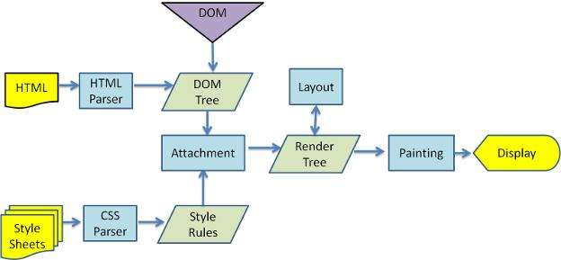

# HTML5+CSS+JavaScript

HTML、 CSS、 JavaScript三者的关系：

```text
网页主要由三部分组成: 结构（Structure）、表现（Presentation) 和行为（Behavior）

HTML —— 结构， 决定网页的结构和内容（ “是什么”）
CSS —— 表现（样式） ， 设定网页的表现样式（ “什么样子”）
JavaScript（JS） —— 行为， 控制网页的行为（ “做什么”）
```

## HTML5

- Learn the basics and how to write semantic HTML
- Understand how to divide page into sections and to structure the DOM properly
- Task Make at least several HTML pages – focus on structure, don't worry about the beauty yet
- Web Generation(SAP Web Tech)
- Rendering

## CSS

- Learn the basics of CSS
- Learn how to use Grid and Flexbox
- Media queries and how to make responsive websites
- Understand CSS Specificity, Box-Model etc
- Task Style the HTML pages that you made in last step

## JS

- Learn the syntax and the basic constructs
- Learn how to manipulate DOM
- Understand the concepts such as hoisting, event bubbling, prototypes etc
- Learn Ajax (XHR)
- Learn new features in ES6+ and how to write modular JavaScript

- [JS style guide](js_style_guide.md)

