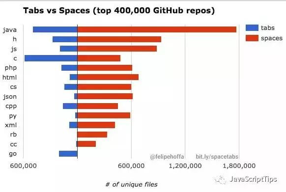

# JS Style Guide

## 什么是编码规范

编码规范就是指导如何编写和组织代码的一系列标准。通过阅读这些编码规范，你可以知道在各个公司里代码是如何编写的。

## 我们为什么需要编码规范

一个主要的原因是：每个人写代码的方式都是不同的。我可能喜欢这么写，而你喜欢用另一种方法写。如果我们只处理自己的代码，这样并没有什么问题。但如果有成千上万的程序员同时在一个代码库上面工作呢？如果没有规范，事情很快会变得一团糟。代码规范可以让新人迅速的熟悉相关的代码，并且也能写出让其他程序员简单易懂的代码。

## 常见的5中编码规范

- [Airbnb JavaScript Style Guide](https://github.com/airbnb/javascript)

  `A mostly reasonable approach to JavaScript`

  Airbnb has one of the most popular JavaScript style guides on the internet. It covers nearly every aspect of JavaScript as well.

- [Google JavaScript Style Guide](https://google.github.io/styleguide/jsguide.html)

  `A JavaScript source file is described as being in Google Style if and only if it adheres to the rules herein`

- [Idiomatic JavaScript Style Guide](https://github.com/rwaldron/idiomatic.js/)

  `All code in any code-base should look like a single person typed it, no matter how many people contributed.`

  Another of the most popular JavaScript style guides, the Idiomatic guide is available in multiple languages, and is open to pull requests.

- [JavaScript Standard Style Guide](https://github.com/standard/standard)

  `JavaScript style guide, with linter & automatic code fixer. No configuration. Automatically format code. Catch style issues & programmer errors early.`

  This style guide is used by many tech companies including NPM, GitHub , mongoDB, and ZenDesk.

- jQuery JavaScript Style Guide

提起编码规范，每个组织、团队或个人或许有不同的答案。就如同下面3个问题，你是否会有不同答案？

- 用制表符还是空格在
- 同一行中使用打括号还是新起一行
- 每行是80个字符还是120个

即便如此我们必须做出选择，也就是在同一个团队，至少是一个项目中约定统一的规则。那么我们应该如何选择呢？2016 年，谷歌程序员 Felipe Hoffa分析了10亿份代码，得出了使用Tab和空格的对比情况。分析结果可先看下图：

选择什么样的编码规范没有标准答案，只有开发者的选择。

一、基本规则（常见标准）

- JS
  - 区分大小写
  - JS中变量驼峰命名(常量的形式如: NAMES THIS)
  - 使用单引号 using ' , not "
  - 不混用空格和Tab
  - 去掉行末的空格(vs code快捷键ctrl k ctrl x)
  - 同一行上插入大括号
- HTML
  - 一般小写命名
  - 一般使用 abcd-efgh
  - 使用双引号
- CSS
  - 一般小写命名
  - 一般使用 abcd-efgh
  - 使用双引号

## Reference

- [有哪些比较好的 JavaScript 代码风格？](https://www.zhihu.com/question/19738255/answer/333207243)