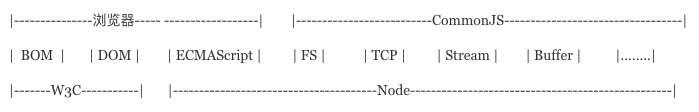

# CommonJS and AMD

随着前端js代码复杂度的提高，JavaScript模块化这个概念便被提出来，前端社区也不断地实现前端模块化，直到es6对其进行了规范，下面就介绍JavaScript模块化。

## 无模块化

JavaScript最初的作用仅仅是验证表单，后来会添加一些动画，但是这些js代码很多在一个文件中就可以完成了，所以，我们只需要在html文件中添加一个script标签。

后来，随着前端复杂度提高，为了能够提高项目代码的可读性、可扩展性等，我们的js文件逐渐多了起来，不再是一个js文件就可以解决的了，而是把每一个js文件当做一个模块。那么，这时的js引入方式是怎样的呢？大概是下面这样：

```html
<script src="jquery.js"></script>
<script src="jquery_scroller.js"></script>
<script src="main.js"></script>
<script src="other1.js"></script>
<script src="other2.js"></script>
<script src="other3.js"></script>
```

即简单的将所有的js文件统统放在一起。但是这些文件的顺序还不能出错，比如jquery需要先引入，才能引入jquery插件，才能在其他的文件中使用jquery。
加载的时候，浏览器会停止网页渲染，加载文件越多，网页失去响应的时间就会越长。

优点：

相比于使用一个js文件，这种多个js文件实现最简单的模块化的思想是进步的。

缺点：

污染全局作用域。 因为每一个模块都是暴露在全局的，简单的使用，会导致全局变量命名冲突，当然，我们也可以使用命名空间的方式来解决。

对于大型项目，各种js很多，开发人员必须手动解决模块和代码库的依赖关系，后期维护成本较高。依赖关系不明显，不利于维护。 比如main.js需要使用jquery，但是，从上面的文件中，我们是看不出来的，如果jquery忘记了，那么就会报错。

## CommonJS

是js的`规范`，根据这个规范，每一个文件就是一个模块，其内部定义的变量是属于这个模块的，不会对外暴露，也就是说不会污染全局变量。

`曾用名`：ServerJS

`开始时间`：2009.1

`负责人`：Moziliz的工程师Kevin Dangoor, ECMAScript的成员也有参与

`原因`：CommonJS 是以在浏览器环境之外构建 JavaScript 生态系统为目标而产生的项目，比如在服务器和桌面环境中。

`目的`：js在任何地方运行，不只是浏览器中

`契机`：Node的带动下使其变得有影响力

CommonJS 规范是为了解决 JavaScript 的作用域问题而定义的模块形式



_CommonJS定义的模块分为:{模块引用(require)} {模块定义(exports)} {模块标识(module)}_

```text
require()用来引入外部模块；exports对象用于导出当前模块的方法或变量，唯一的导出口；module对象就代表模块本身。
```

虽说Node遵循CommonJS的规范，但是相比也是做了一些取舍，填了一些新东西的。2013年5月，Node.js 的包管理器 NPM 的作者 Isaac Z. Schlueter 说 `CommonJS 已经过时，Node.js 的内核开发者已经废弃了该规范。`

***热门讨论点：***

- 只在运行时加载意味着只在第一次加载时运行一次，然后结果缓存，后面在读取只读缓存，要让模块在运行，必须清除缓存
- 模块加载运行，就是代码出出现位置的顺序[0][1].....

## AMD

AMD（异步模块定义）是为浏览器环境设计的，因为 CommonJS 模块系统是同步加载的，当前浏览器环境还没有准备好同步加载模块的条件。

AMD 定义了一套 JavaScript 模块依赖异步加载标准，来解决同步加载的问题。

`原因`：

CommonJS主要是为了后端定制，而且同步加载，不适合前端，因为如下区别：
||服务器JS|浏览器JS|
|--------- |:---------:|:---------:|
|执行|相同的代码要执行多次|代码从一个服务器分发到多个客户端执行|
|加载|从磁盘加载|网络加载
|瓶颈|CPU和内存资源|带宽|
如上所以CommonJS是先把整个模块加载完形成一个对象，在执行后面的操作，这意味着整个过程是一个同步事件，如果应用在服务器上，模块文件都存于本地硬盘加载比较快就不用考虑非同步加载的方式，所以CommonJS规范还是比较适用的。但是如果从浏览器环境，可能要从服务器端进行模块的加载 （可能导致性能上，可用性，调试和跨域访问等问题），这时就可能必须要使用非同步模式，所以就有了AMD规范。

`目的`：js前端模块化并异步加载

模块通过 define 函数定义在闭包中，格式如下：

```text
define(id?: String, dependencies?: String[], factory: Function|Object);
```

通过define来定义一个模块，然后使用require来加载一个模块

```text
require([module], callback)
```

***RequrieJS其实就是AMD现在用的最广泛，最流行的实现***

- 实现js文件的异步加载，避免网页失去响应。
- 管理模块之间的依赖性，便于代码的编写和维护。

具体用法可以参考[require.js的用法](http://www.ruanyifeng.com/blog/2012/11/require_js.html?bsh_bid=230697246)

优点：

适合在浏览器环境中异步加载模块。可以并行加载多个模块。

缺点：

提高了开发成本，并且不能按需加载，而是必须提前加载所有的依赖。

## CMD

通用模块定义

CMD规范是阿里的玉伯提出来的，实现js库为sea.js。 它和requirejs非常类似，即一个js文件就是一个模块，但是CMD的加载方式更加优秀，是通过按需加载的方式，而不是必须在模块开始就加载所有的依赖。
CMD推崇依赖就近，延迟执行。可以把你的依赖写进代码的任意一行。

***SeaJS就是实现了这种规范***

## ES6 Module

之前的几种模块化方案都是前端社区自己实现的，只是得到了大家的认可和广泛使用，而ES6的模块化方案是真正的规范。 在ES6中，我们可以使用 import 关键字引入模块，通过 export 关键字导出模块，功能较之于前几个方案更为强大，但是由于ES6目前无法在浏览器中执行，所以，我们只能通过babel将不被支持的import编译为当前受到广泛支持的require。

## Reference

- [CommnJS规范](http://zhaoda.net/webpack-handbook/commonjs.html)
- [浅析JS中的模块规范](http://www.cnblogs.com/skylar/p/4065455.html)
- [JavaScript模块化 --- Commonjs、AMD、CMD、ES6 modules](https://www.imooc.com/article/20057)
- [CommonJS，AMD，CMD，ES6模块规范](https://blog.csdn.net/qq_26878975/article/details/72803231)

