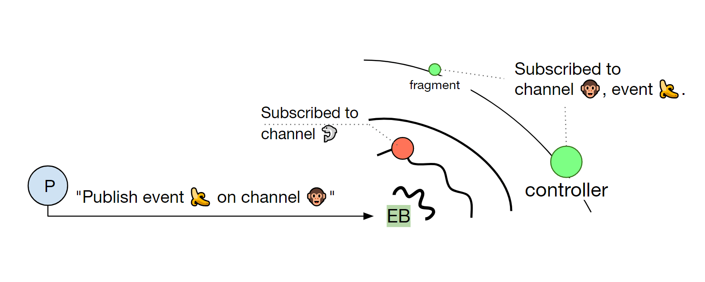

# EventBus

The EventBus in UI5 is a tool with which we can leverage publish-subscribe pattern in our app.

## How do we get EventBus

Currently, there are two APIs which return their own instance of an EventBus:

- Globally: `sap.ui.getCore().getEventBus();` e.g. for..:
  - Stand-alone apps
  - Minimal demos in code sharing platforms (such as JSBin)
- Component-based: `this.getOwnerComponent().getEventBus();` // Given this === controller for Fiori apps. Since "apps" on Fiori Launchpad (FLP) are components, SAP recommendeds to get the EventBus from the component rather than from the core.

```text
If you need an event bus, use the event bus of the component. By this, you avoid conflicting event names and make sure that your listeners are automatically removed when the component is unloaded. Do not use the global event bus.
```

**Note:** FLP destroys the component every time when the user navigates back Home.

## What is it for

With EventBus, we can fire (via publish), and listen (via subscribe) to our own custom events freely:

- Without having to use or extend any Control / ManagedObject / EventProvider classes,
- Without knowing the existence of other involved listeners (if any),
- Without accessing the object that fires the event (publisher). E.g.: No need to call thatManagedObj.attach*().
- Publishers and subscribers stay ignorant to each other which makes the loose coupling possible.

Analogous to the real world, an EventBus is like a radio station. Once it starts to broadcast about all sorts of things on various channels, those, who are interested, will listen to their interested channel, get notified, and do something productive with the given data. Here is an image that illustrates the basic behavior of an EventBus.


To be honest, I haven't come across any situation yet in which I'd have favored EventBus over standard solutions. If we follow best-practices, we hardly need it in UI5.

## EventBus is evil

This has the following implications:
- from [Why the UI5 EventBus is evil and shouldn't be used (Re-post)](https://jam4.sapjam.com/blogs/show/87t92W2ULB5sqYhSNCvObA?_lightbox=true)
  - Using the global EventBus is like using global variables. Everyone, known or unkown to you, can listen to and fire events. There is no defined namespacing concept and of course it gets interesting when you are dealing with several instances of the same reusable component. While everything seems to work fine when testing your application standalone, you get into troubles as soon as it is integrated and runs side by side with other applications. A nightmare.
  - Using the EventBus makes your code less readable and less maintainable. From my point of view, when you need an EventBus, you have some deeper structural issue in your application that prevents you to make objects known to each other  which need to communicate. Due to the event bus the actions caused by a specific event are no longer described in a single location and properly delegated across your object hierarchy, but code handling an event is scattered all over your project, the only possibility to find it is the search and the execution order of different handlers is more or less undefined, so you may even run into timing/order issues.
- see also [Global Variables are Bad](http://wiki.c2.com/?GlobalVariablesAreBad)

Suggested measures:
- for future development, and when you touch old code, don't use the Event Bus. There are always alternatives, such as using the routing mechanism, sharing instances across controllers via the component, etc.

As I know, the EventBus is designed as publish-subscribe pattern. Publishers and subscribers stay ignorant to each other which makes the loose coupling possible. We can fire custom events easily, I think that is why it is popular.

>global EventBus is like using global variables

That means using sap.ui.getCore().getEventBus(). So how about component-based like this.getOwnerComponent().getEventBus()? Listeners are automatically removed when the component is unloaded.

>Using the EventBus makes your code less readable and less maintainable

Do we have same situation using Event, so how about using sap.ui.base.EventProvider? or we should avoid to use custom event in our app.